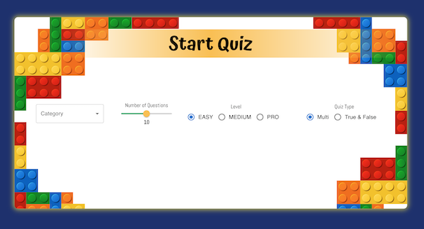

# Quiz-project _React-TypeScript_

#### The Quiz is a web application that allows users to participate in quizzes and test their knowledge on various topics. It provides an interactive and engaging platform for users to challenge themselves and have fun while learning. Quiz Categories: The app offers a wide range of quiz categories, such as General Knowledge, Science, History, Sports, etc., catering to different interests and knowledge areas.

#### Quiz Selection: Users can choose quizzes from different categories and difficulty levels based on their preferences.

#### Timer: Quizzes are timed to add excitement and encourage users to answer questions quickly.

#### Multiple Choice Questions and True & False: The app presents multiple-choice questions to users, with options to select the correct answer from the given choices.

#### Score Tracking: The app keeps track of the user's score.

# [OPEN APPLICATION](https://maxoverking.github.io/Quiz-project/) HERE :eyes: !!!

## Application INTERFACE



## Quick Start 🖥️ 🚀

To get start application, follow these steps:

1. Clone this repository to your local machine.
2. Open the terminal and navigate to the project directory.
3. Run the following commands:

```
npm i
npm run dev
```

## Used Libraries and Technologies

- React
- React Hooks
- React Router Dom
- Redux-Toolkit
- Styled Components
- Material-UI
- Axios
- React Icons
- Gsap
- Responsive design
